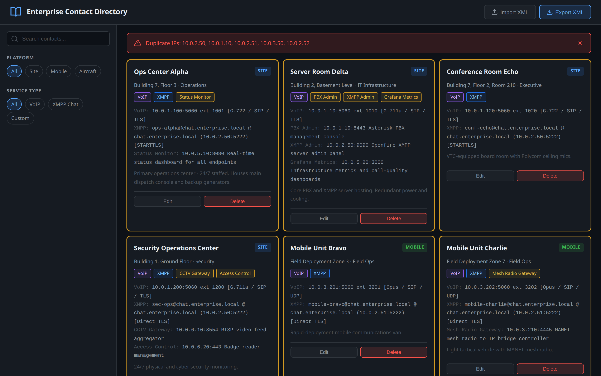
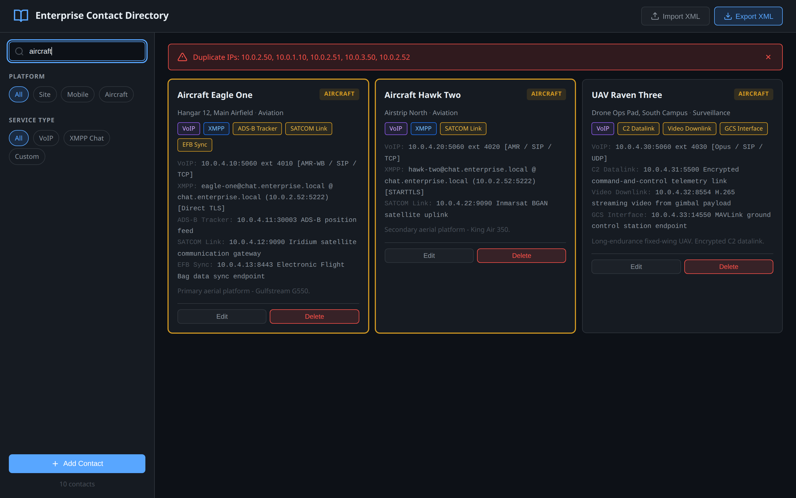
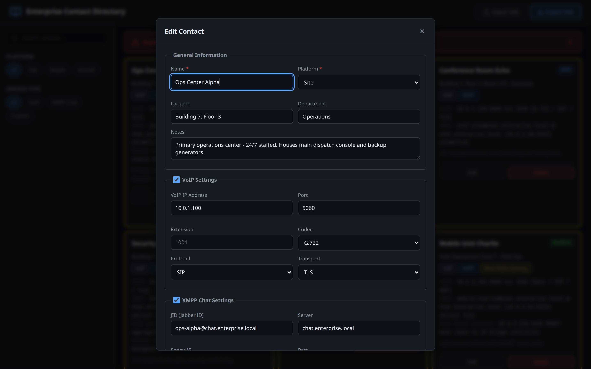
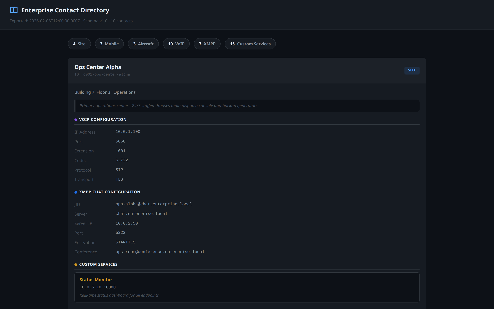
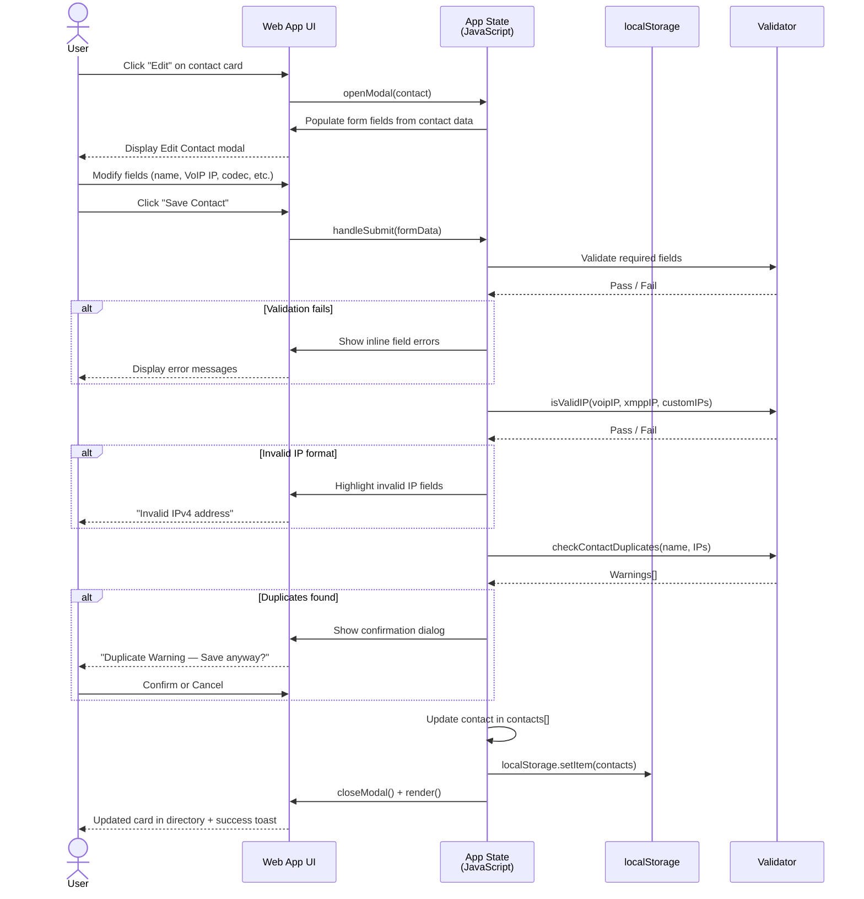
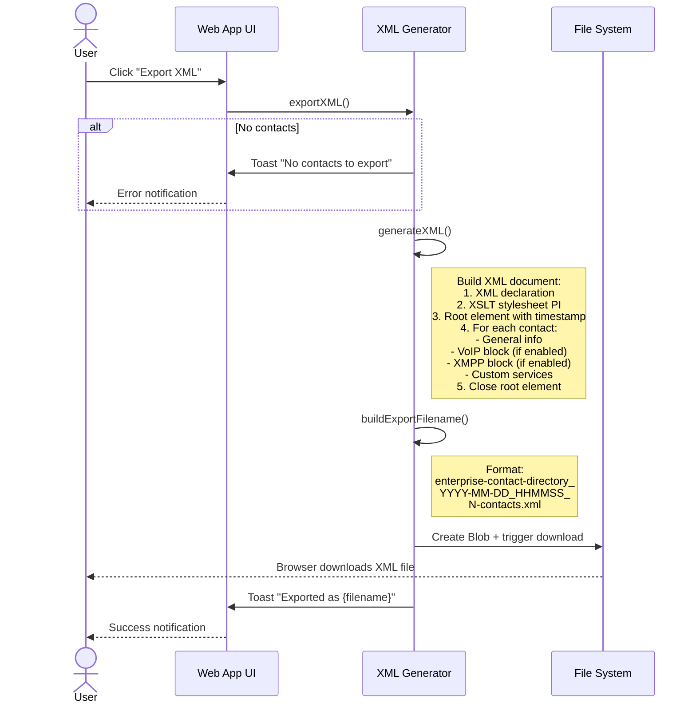
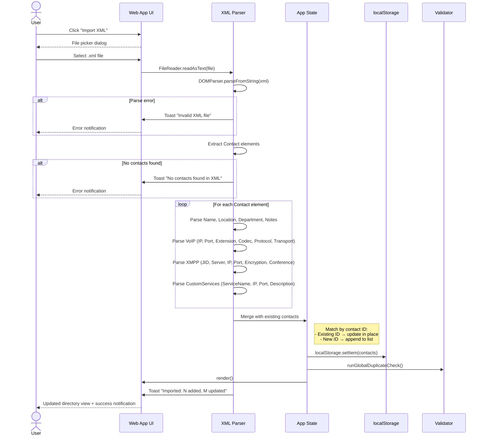

# Enterprise Contact Directory

A self-contained web application for managing an organisation's communication endpoints -- VoIP phones, XMPP chat accounts, and custom network services -- across **site**, **mobile**, and **aircraft** platforms. Data is stored and distributed as a portable XML file.

**Commlink-Directory is the source of truth** for contact endpoints, scarce comm resources, contracts, comm links, and reservations consumed by [Commlink-Schedule](https://github.com/mowgli42/Commlink-Schedule), [o-my](https://github.com/mowgli42/o-my), and [o-my-sim](https://github.com/mowgli42/o-my-sim). See [`docs/COMMLINK-INTEGRATION-ROADMAP.md`](docs/COMMLINK-INTEGRATION-ROADMAP.md) for the cross-repo phase plan.



---

## Table of Contents

- [Features](#features)
- [Quick Start](#quick-start)
- [Screenshots](#screenshots)
- [Workflows](#workflows)
  - [Editing a Contact](#editing-a-contact)
  - [Exporting XML](#exporting-xml)
  - [Importing XML](#importing-xml)
- [XML Schema](#xml-schema)
  - [Document Structure](#document-structure)
  - [Platforms](#platforms)
  - [VoIP Settings](#voip-settings)
  - [XMPP Chat Settings](#xmpp-chat-settings)
  - [Custom Services](#custom-services)
  - [Data Validation Rules](#data-validation-rules)
- [Viewing XML in a Browser](#viewing-xml-in-a-browser)
- [File Reference](#file-reference)
- [Technology](#technology)

---

## Features

| Capability | Description |
|---|---|
| **Contact Management** | Add, edit, and delete contacts with full CRUD operations |
| **VoIP Configuration** | Track IP, port, extension, codec (G.711/G.722/G.729/Opus/AMR/...), protocol (SIP/H.323/IAX2/SCCP), and transport (UDP/TCP/TLS) |
| **XMPP Chat** | JID, server, IP, port, encryption mode (STARTTLS/Direct TLS/None), conference rooms |
| **Custom Services** | Unlimited per-contact service entries with name, IP, port, and description |
| **Platform Types** | Site (fixed installations), Mobile (vehicles/portable kits), Aircraft (fixed-wing/rotary/UAV) |
| **Search** | Real-time full-text search across all fields |
| **Filtering** | Filter chips for platform and service type |
| **Duplicate Detection** | Automatic warning banner when duplicate IPs or contact names are detected |
| **XML Export** | One-click download with unique, human-readable filename |
| **XML Import** | Load and merge XML files with existing data |
| **Browser-Viewable XML** | Exported XML renders as a styled page via XSLT -- no app needed |
| **Dark Theme** | High-contrast dark UI following IxDF best practices |
| **Responsive** | Desktop sidebar layout collapses to mobile-friendly stacked view |
| **Zero Dependencies** | Pure HTML + CSS + vanilla JavaScript -- no build step |

---

## Quick Start

1. **Clone the repository:**
   ```bash
   git clone https://github.com/mowgli42/Commlink-Directory.git
   cd Commlink-Directory
   ```

2. **Serve locally** (recommended for full XSLT support):
   ```bash
   # Any static file server works. For example:
   python3 -m http.server 8000
   # Then open http://localhost:8000
   ```
   Alternatively, open `index.html` directly in your browser -- the web app works fine over `file://`, but viewing exported XML via XSLT requires an HTTP server in Chrome/Edge (Firefox works with `file://`).

3. **Load sample data:**
   Click **Import XML** in the header and select `sample-directory.xml` to populate the directory with 10 example contacts plus v1.1 scheduling sections (resources, contracts, comm links, reservations).

4. **Run format tests** (optional):
   ```bash
   npm install
   npm test
   ```

---

## Screenshots

### Main Directory View

The card-based layout shows all contacts at a glance with platform badges, service tags, and connection details. A persistent validation banner alerts when duplicate IPs or names are detected.


### Search & Filtering

Type into the search box to instantly filter contacts across all fields. Use the sidebar chips to narrow by platform or service type.



### Edit Contact Modal

A structured form with collapsible sections for VoIP, XMPP, and Custom Services. Toggle each section on/off with the checkbox. IP addresses are validated on save, and duplicate warnings appear before committing.



### XML Browser View (via XSLT)

Exported XML files render as a fully styled, dark-themed HTML page when opened in a browser -- no application required. Summary chips show counts by platform and service type.



---

## Workflows

### Editing a Contact



### Exporting XML



### Importing XML



---

## XML Schema

The full schema is defined in [`enterprise-contact-directory.xsd`](enterprise-contact-directory.xsd). Below is a summary.

### Versions

| Version | Layout | Use |
|---|---|---|
| **1.0** | `<Contact>` elements directly under the root | Address book only (backward compatible) |
| **1.1** | `<Contacts>` wrapper plus optional `<Resources>`, `<Contracts>`, `<CommLinks>`, `<Reservations>` | Scheduling, utilization, and live status downstream |

v1.0 contact-only files import unchanged. Export uses v1.1 when scheduling sections are present; otherwise it emits v1.0 contact-only XML. Parser logic lives in [`directory-xml.js`](directory-xml.js).

### Document Structure (v1.0)

```xml
<?xml version="1.0" encoding="UTF-8"?>
<?xml-stylesheet type="text/xsl" href="enterprise-contact-directory.xsl"?>
<EnterpriseContactDirectory exported="2026-02-06T12:00:00.000Z" version="1.0">
  <Contact id="unique-id" platform="site|mobile|aircraft">
    <Name>Display Name</Name>              <!-- required, should be unique -->
    <Location>Physical location</Location>  <!-- optional -->
    <Department>Org unit</Department>       <!-- optional -->
    <Notes>Free text</Notes>                <!-- optional -->
    <CreatedAt>ISO 8601</CreatedAt>         <!-- optional -->
    <UpdatedAt>ISO 8601</UpdatedAt>         <!-- optional -->
    <VoIP>...</VoIP>                        <!-- optional -->
    <XMPP>...</XMPP>                        <!-- optional -->
    <CustomServices>...</CustomServices>     <!-- optional -->
  </Contact>
</EnterpriseContactDirectory>
```

### Document Structure (v1.1 scheduling extensions)

```xml
<EnterpriseContactDirectory exported="2026-02-10T12:00:00.000Z" version="1.1">
  <Contacts>
    <Contact id="c005-mobile-unit-bravo" platform="mobile">
      <Name>Mobile Unit Bravo</Name>
      <Position lat="34.1000" lon="-118.3000" alt_m="0" />
      <Capabilities>
        <Capability kind="satcom" resourceRef="res-iridium-lband" />
      </Capabilities>
      <!-- VoIP, XMPP, CustomServices as in v1.0 -->
    </Contact>
  </Contacts>
  <Resources>
    <Resource id="res-iridium-lband" kind="satellite_transponder" provider="Iridium" status="operational">
      <Capacity bandwidth_khz="41.667" channels="2" maxConcurrentLinks="2" />
      <Availability start="2026-02-10T00:00:00Z" end="2026-02-11T00:00:00Z" recurrence="daily" />
    </Resource>
  </Resources>
  <Contracts>
    <Contract id="contract-iridium-metered" resourceRef="res-iridium-lband"
              billingModel="pay_per_minute" label="$/MIN">
      <Included minutes="60" />
      <Overage rate="2.00" currency="USD" unit="minute" />
    </Contract>
  </Contracts>
  <CommLinks>
    <CommLink id="link-004" type="satellite" subtype="LEO"
              resourceRef="res-iridium-lband" contractRef="contract-iridium-metered">
      <Endpoint contactRef="c001-ops-center-alpha" />
      <Endpoint contactRef="c008-aircraft-eagle-one" />
      <Schedule start="2026-02-10T00:00:00Z" end="2026-02-11T00:00:00Z" recurrence="daily" />
      <Frequency value_mhz="1616.0" bandwidth_khz="41.667" />
    </CommLink>
  </CommLinks>
  <Reservations>
    <Reservation id="resv-002" resourceRef="res-iridium-lband" linkRef="link-004"
                 status="approved" priority="routine">
      <Window start="2026-02-10T14:00:00Z" end="2026-02-10T16:00:00Z" />
      <Mission>Airborne surveillance fallback</Mission>
    </Reservation>
  </Reservations>
</EnterpriseContactDirectory>
```

**Billing model vocabulary** (shared across Commlink repos): `subscription`, `owned`, `pay_per_minute`, `pay_per_mb`, `reservation`, `hybrid`.

### Platforms

| Value | Description |
|---|---|
| `site` | Fixed installation (building, office, data centre) |
| `mobile` | Ground-based mobile unit (vehicle, portable kit) |
| `aircraft` | Airborne platform (fixed-wing, rotary, UAV) |

### VoIP Settings

```xml
<VoIP>
  <IP>10.0.1.100</IP>            <!-- IPv4 dotted-decimal -->
  <Port>5060</Port>              <!-- 1–65535, default 5060 -->
  <Extension>1001</Extension>    <!-- PBX extension -->
  <Codec>G.722</Codec>           <!-- see codec table -->
  <Protocol>SIP</Protocol>       <!-- SIP | H.323 | IAX2 | SCCP -->
  <Transport>TLS</Transport>     <!-- UDP | TCP | TLS -->
</VoIP>
```

**Supported Codecs:**

| Codec | Description |
|---|---|
| `G.711u` | G.711 mu-law (PCMU) |
| `G.711a` | G.711 A-law (PCMA) |
| `G.722` | Wideband 7 kHz |
| `G.729` | Low-bitrate 8 kbps |
| `Opus` | Adaptive wideband |
| `iLBC` | Internet Low Bitrate |
| `Speex` | Open-source codec |
| `AMR` | Adaptive Multi-Rate |
| `AMR-WB` | AMR Wideband |

### XMPP Chat Settings

```xml
<XMPP>
  <JID>user@chat.example.com</JID>                        <!-- Jabber ID -->
  <Server>chat.example.com</Server>                        <!-- hostname -->
  <IP>10.0.2.50</IP>                                      <!-- server IPv4 -->
  <Port>5222</Port>                                        <!-- default 5222 -->
  <Encryption>STARTTLS</Encryption>                        <!-- STARTTLS | Direct TLS | None -->
  <Conference>ops@conference.example.com</Conference>      <!-- MUC room JID -->
</XMPP>
```

### Custom Services

```xml
<CustomServices>
  <Service>
    <ServiceName>Status Monitor</ServiceName>
    <IP>10.0.5.10</IP>
    <Port>8080</Port>
    <Description>Real-time status dashboard</Description>  <!-- optional -->
  </Service>
  <!-- additional Service elements as needed -->
</CustomServices>
```

### Data Validation Rules

| Rule | Scope | Behaviour |
|---|---|---|
| **Required fields** | Name, Platform | Blocks save with inline error |
| **IPv4 format** | All IP fields | Validates `0-255.0-255.0-255.0-255` pattern; blocks save on invalid |
| **Port range** | All port fields | Must be 1 -- 65535 |
| **Duplicate names** | Global (all contacts) | Warning banner + amber card highlight; confirmation prompt on save |
| **Duplicate IPs** | Global (VoIP, XMPP, and custom service IPs) | Warning banner + amber card highlight; confirmation prompt on save |

---

## Viewing XML in a Browser

Every exported XML file includes an XSLT processing instruction:

```xml
<?xml-stylesheet type="text/xsl" href="enterprise-contact-directory.xsl"?>
```

When you open the `.xml` file in **Chrome**, **Firefox**, or **Edge**, the browser automatically transforms it into a styled dark-themed HTML page:


**Requirements:**
- The `enterprise-contact-directory.xsl` file must be in the **same directory** as the XML file (or the `href` must be adjusted to point to its location).
- **Chrome/Edge** block XSLT over `file://` due to CORS restrictions. Use a local HTTP server (e.g. `python3 -m http.server`) or **Firefox**, which allows `file://` XSLT transforms.
- Includes print-friendly styles -- press `Ctrl+P` to switch to a light theme automatically.

---

## File Reference

| File | Purpose |
|---|---|
| [`index.html`](index.html) | Application HTML structure and layout |
| [`styles.css`](styles.css) | Dark theme stylesheet (CSS custom properties, responsive breakpoints) |
| [`directory-xml.js`](directory-xml.js) | XML v1.0/v1.1 parser and exporter (browser + Node tests) |
| [`app.js`](app.js) | Application logic -- CRUD, search, filtering, XML import/export, validation |
| [`enterprise-contact-directory.xsd`](enterprise-contact-directory.xsd) | XML Schema Definition documenting the data format |
| [`enterprise-contact-directory.xsl`](enterprise-contact-directory.xsl) | XSLT stylesheet for rendering XML in browsers |
| [`sample-directory.xml`](sample-directory.xml) | v1.1 fixture: contacts, resources, contracts, comm links, reservations |
| [`fixtures/sample-directory-v1.0.xml`](fixtures/sample-directory-v1.0.xml) | v1.0 contact-only fixture for compatibility tests |
| [`tests/test-directory-xml.mjs`](tests/test-directory-xml.mjs) | Round-trip and compatibility tests (`npm test`) |

---

## Technology

- **Frontend:** Vanilla HTML5, CSS3, JavaScript (ES6+) -- zero runtime dependencies in the browser
- **Tests:** Node built-in test runner + `@xmldom/xmldom` (dev only, `npm test`)
- **Data format:** XML 1.0 with XSD schema validation
- **Browser rendering:** XSLT 1.0 transformation
- **Persistence:** Browser `localStorage` for session data; XML file export for distribution
- **Design system:** IxDF-inspired dark theme with CSS custom properties, 4.5:1+ contrast ratios, accessible focus states, and responsive grid layout
